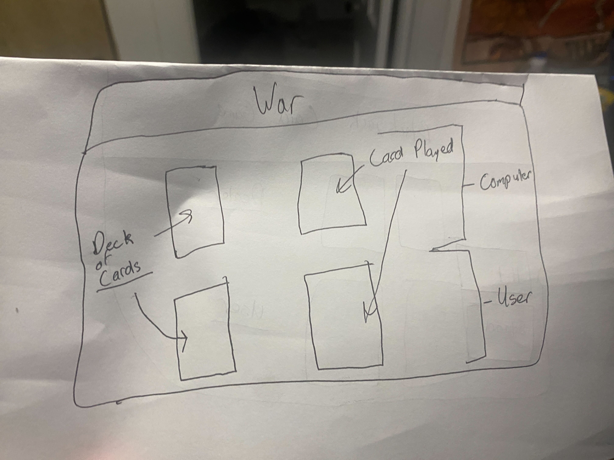
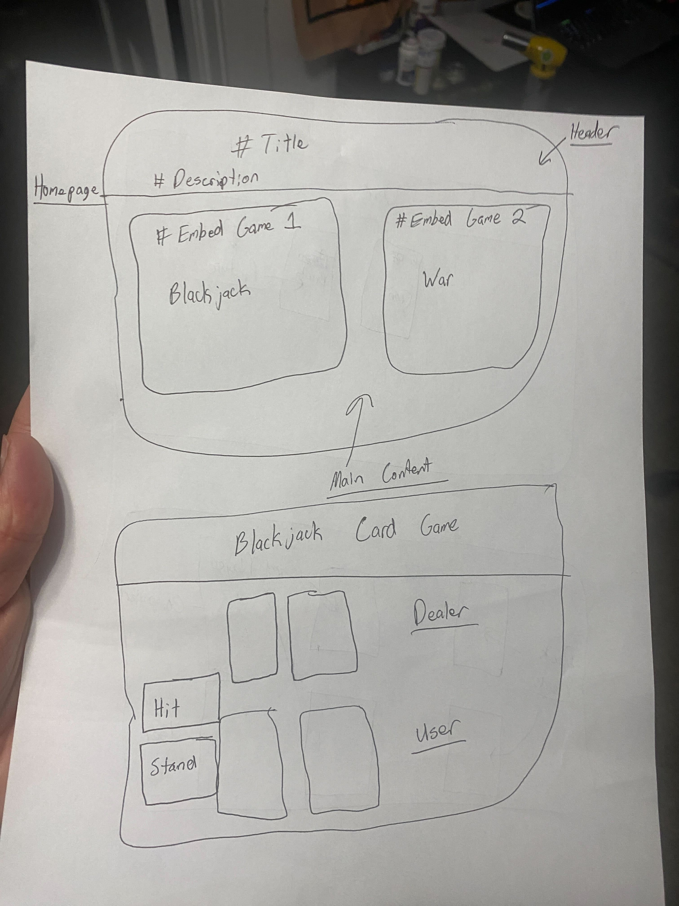

# Title

Card Game Application - TBD

# Project description

 In this project we want to create a card playing game application that will present the user with two game options. the API's we want to use: one creates the cards themselves which we will then have to program the game rules. The second API will create and/or pull images to apply to the back of the cards.

The two games will be War and 21.

# User Story 

As a gamer 
I want to be able to play a simple card game in my free time 
So that I can entertain myself in my spare time

# WireFrame or sketch a design

# APIs to be used 
<ul>
<li>https://dog.ceo/api/breeds/image/random</li>
<li>https://deckofcardsapi.com/</li>
</ul>

# Rough breakdown of tasks

<ol>
<li>3 separate simple html- Ayden</li>
<li>2 separate JavaScript files - Shared</li>
<li>program rules for each game - Travis </li>
<li>figure out api's and get attached to correct cards - Chris</li>
<li>1-3 separate CSS files - Chris</li>
</ol>

